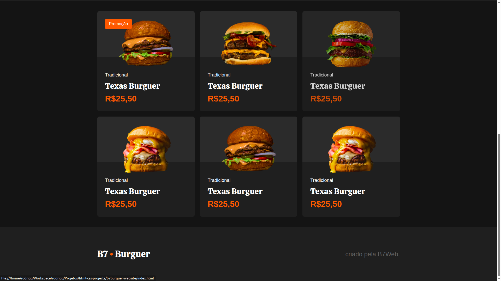

# HTML & CSS Projects

This repository contains a collection of complete HTML and CSS projects, developed to practice and enhance front-end development skills. Each project focuses on structure, styling, and responsive design techniques.

## 📂 Included Projects

### 1. Awax Website
A modern multi-section website template with smooth scrolling, responsive layout, and clean design principles.  

### 2. B7Burger Website
A fictional burger restaurant landing page with menu highlights, promotional sections, and responsive navigation.  

### 3. Starbucks Clone
A clone of Starbucks' landing page, featuring product highlights, promotional banners, and modern UI design.  

### 4. Medicenter Template
A medical clinic website template with a services overview, contact form, and responsive grid layout.  

### 5. Portfolio Template
A personal portfolio layout showcasing projects, skills, and contact information with a minimal design.  

---

## 🛠 Technologies Used
- *HTML5*
- *CSS3*
- *Flexbox*
- *CSS Grid*
- *Responsive Design*
- Media Queries (for responsiveness)

---

## 🎯 Purpose
This repository is intended for:
- Practicing real-world website layouts
- Improving HTML and CSS coding skills
- Serving as a showcase for personal projects

---

## 📸 Full Gallery

### Awax Website

### B7Burguer Website

### Starbucks Website

### Medicenter Template

### Portfolio Template

